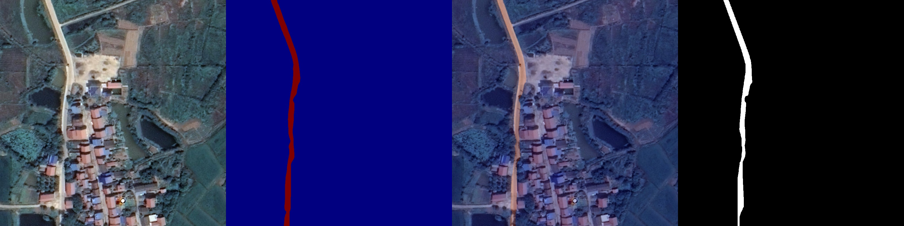

# RefSeg-RS Runtime

A lightweight PyTorch runtime for referring image segmentation on remote-sensing imagery. The repository provides model code, dataset checks, evaluation scripts, visualization utilities, continuation-training entrypoints, and reproducible metric reports for two dataset lines.

## Features

- Query-conditioned mask decoding for language-aware local feature modulation.
- Multi-scale visual-language fusion with sparse attention-style feature interaction.
- Metric-specific checkpoint selection for mIoU/oIoU evaluation.
- Lightweight runtime for evaluation, visualization, checkpoint inspection, and continuation training.
- Dataset checking and preprocessing utilities for referring segmentation datasets.

## Results

This release keeps separate checkpoint/report choices for metric-specific evaluation rather than presenting a single universal best checkpoint.

| Dataset | Checkpoint target | Split / samples | Threshold | mIoU | oIoU | Report |
| --- | --- | ---: | ---: | ---: | ---: | --- |
| refer_data_20250908 | mIoU-best | val / 4,000 | 0.3 | 74.94 | 81.18 | results/eval_reports/eval_refer_miou/report_t03.json |
| refer_data_20250908 | oIoU-best | val / 4,000 | 0.3 | 74.38 | 81.32 | results/eval_reports/eval_refer_oiou/report_t03.json |
| RSRefSegRS | test mIoU-best | test / 1,817 | 0.5 | 72.76 | 79.25 | results/eval_reports/eval_rsrefsegrs_test_miou/report_t05.json |
| RSRefSegRS | test oIoU-best | test / 1,817 | 0.5 | 72.74 | 79.49 | results/eval_reports/eval_rsrefsegrs_test_oiou/report_t05.json |

Full JSON summaries are available in results/combined_summary.json and results/rsrefsegrs_summary.json.

## Visual Examples

Each example shows four panels from left to right: image, predicted mask heatmap, prediction overlay, and ground-truth mask.

### refer_data_20250908

  
  
  

### RSRefSegRS

  
  
  

## Repository Layout

    refseg_runtime/      Runtime package for inference, eval, visualization, and training
    scripts/             Shell entrypoints for env checks, data checks, eval, and resume training
    docs/                Environment, data preparation, running, and troubleshooting notes
    requirements/        Runtime dependency list
    results/             Reproducible evaluation summaries and JSON reports
    tools/               Helper utilities
    examples/            Local path configuration templates
    checkpoints/         Checkpoint download/placement notes

Large .pth checkpoint files are intentionally not committed to the repository. Place downloaded .state_dict.pth files under checkpoints/ following checkpoints/README.md.

## Quick Start

    python3.10 -m venv .venv
    source .venv/bin/activate
    python -m pip install --upgrade pip setuptools wheel
    python -m pip install -r requirements/runtime.txt
    cp examples/paths.env.example examples/paths.env
    ${EDITOR:-vi} examples/paths.env
    export REFSEG_PATHS_FILE="$PWD/examples/paths.env"
    source examples/env.sh
    scripts/check_env.sh

Then validate data and run evaluation:

    scripts/check_data_refer.sh
    scripts/check_data_rsrefsegrs.sh
    scripts/eval_refer_miou.sh
    scripts/eval_refer_oiou.sh
    scripts/eval_rsrefsegrs_test_miou.sh
    scripts/eval_rsrefsegrs_test_oiou.sh

See docs/DEPLOY_AND_RUN.md for full commands and smoke-test variants.

## License

See LICENSE.
